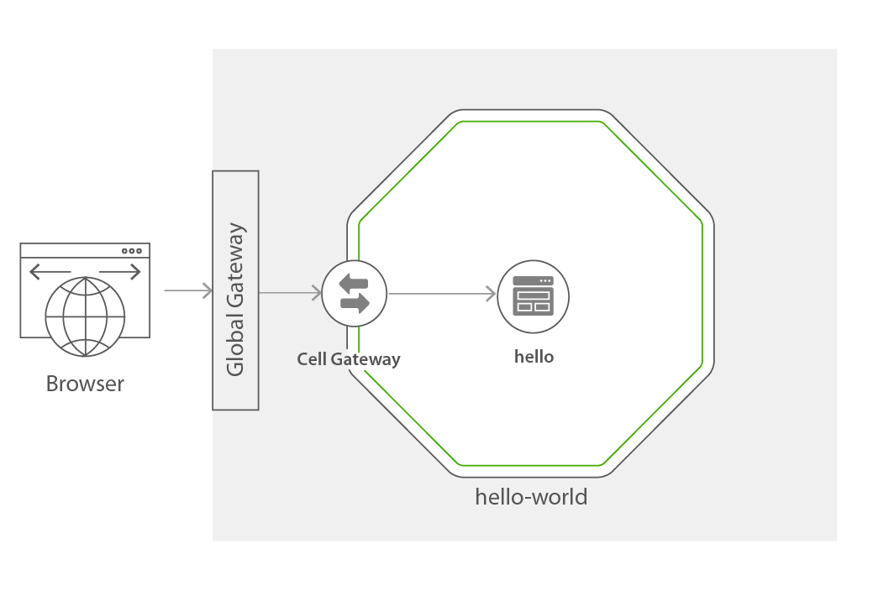

Hello World
=========

Hello World is a simple static website that serves Hello World on top of Cellery.



## Hello-World Cell

This contains a single component which serves the HTML web page. The web page runs on top of NGINX and its exposed through a web cell.

## Getting Started

### Checkout the Sample

1. Clone the [wso2-cellery/samples](https://github.com/wso2-cellery/samples) repository
2. Navigate to the hello-world Sample.
   ```
   cd <SAMPLES_ROOT>/hello-world
   ```

### Running the Frontend Cell

1. Build the hello-world Cell.
   ```
   cellery build hello-world.bal wso2cellery/hello-world:0.1.0
   ```
2. Deploy the hello-world Cell
   ```
   cellery run wso2cellery/hello-world:0.1.0 -n hello-world-inst
   ```
3. Check the running Cell.
   ```
   cellery status hello-world-inst
   ```

Please feel free to checkout this repository and play around with the sample.

## Building the Components from Source

You do not need to build the Components if you just wish to deploy the Cells. This should only be done if you wish to change the Hello World sample and play around with it.

### Prerequisites

* Docker
* GNU Make 4.1+

### Building the Components

If you wish to change the Hello World Sample and play around with Cellery, you can follow this section to rebuild the Components.

1. [Checkout](#checkout-the-sample) the Sample
2. Set the following environment variables for customizing the build.

   | Environment Variable  |                                                                       |
   |-----------------------|-----------------------------------------------------------------------|
   | DOCKER_REPO           | The name of the repository of the Docker images (Your Docker Hub ID)  |
   | DOCKER_IMAGE_TAG      | The tag of the Docker images                                          |

3. Run the make target for building docker images.
   ```
   make docker
   ```
   This would build the components from source and build the docker images using the environment variables you have provided.
4. Login to Docker Hub
   ```
   docker login
   ```
5. Run the target for pushing the docker images.
   ```
   make docker-push
   ```
6. Update the `<SAMPLES_ROOT>/hello-world/hello/hello-world.bal` file and set the newly created image names for the Component source.
7. [Build and run](#getting-started) the Cells.
