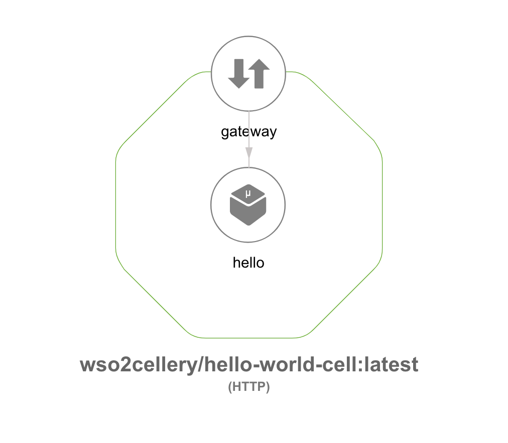

Hello world cell
=========

Hello World is a simple static website that serves Hello World on top of Cellery.


This contains a single component which serves the HTML web page. The web page runs on top of NGINX and its exposed through a web cell.

## Try hello world sample

### 1. Checkout the Sample

1. Clone the [wso2-cellery/samples](https://github.com/wso2-cellery/samples) repository
2. Navigate to the hello-world Sample.
   ```
   cd <SAMPLES_ROOT>/hello-world
   ```

### 2. Build, run and push hello world cell
In this section let's focus on build, run and push a [hello world cell](hello-world.bal). 

The cell `helloCell` consists of one component defined as `helloComponent` and it has one web ingress with default vhost `hello-world.com`.
An environment variable `HELLO_NAME`with default value `Cellery` is used by `helloComponent` to render the webpage. By passing the  parameters in the runtime, the vhost entry and
env variable HELLO_NAME can be modified. 

```
import ballerina/config;
import celleryio/cellery;

// Hello Component
// This Components exposes the HTML hello world page
cellery:Component helloComponent = {
    name: "hello",
    source: {
        image: "wso2cellery/samples-hello-world-webapp"
    },
    ingresses: {
        webUI: <cellery:WebIngress> { // Web ingress will be always exposed globally.
            port: 80,
            gatewayConfig: {
                vhost: "hello-world.com",
                context: "/"
            }
        }
    },
    envVars: {
        HELLO_NAME: {value: "Cellery"}
    }
};

// Cell Initialization
cellery:CellImage helloCell = {
    components: {
        helloComp: helloComponent
    }
};

public function build(cellery:ImageName iName) returns error? {
    return cellery:createImage(helloCell, iName);
}

public function run(cellery:ImageName iName, map<cellery:ImageName> instances) returns error? {
    string vhostName = config:getAsString("VHOST_NAME");
    if (vhostName !== ""){
        cellery:WebIngress web = <cellery:WebIngress> helloComponent.ingresses.webUI;
        web.gatewayConfig.vhost = vhostName;
    }

    string helloName = config:getAsString("HELLO_NAME");
    if (helloName !== ""){
        helloComponent.envVars.HELLO_NAME.value = helloName;
    }
    return cellery:createInstance(helloCell, iName);
}
```
---

Follow below instructions to build, run and push the hello world cell.

1. Build the cellery image for hello world project by executing the cellery build command as shown below. Note `DOCKER_HUB_ORG` is your organization name in docker hub.
    ```
    $ cellery build hello-world.bal <DOCKER_HUB_ORG>/hello-world-cell:1.0.0
    Hello World Cell Built successfully.
    
    ✔ Building image <DOCKER_HUB_ORG>/hello-world-cell:1.0.0
    ✔ Saving new Image to the Local Repository
    
    
    ✔ Successfully built cell image: <DOCKER_HUB_ORG>/hello-world-cell:1.0.0
    
    What's next?
    --------------------------------------------------------
    Execute the following command to run the image:
      $ cellery run <DOCKER_HUB_ORG>/helloworld:1.0.0
    --------------------------------------------------------
    ```

2. As mentioned above in the [hello-world.bal](hello-world.bal), it's looking for runtime parameters `VHOST_NAME` and `HELLO_NAME`, 
and if it's available then it'll will be using those as vhost and greeting name. Therefore run the built cellery image with ‘cellery run’ command, 
and pass `my-hello-world.com` for `VHOST_NAME`, and your name for `HELLO_NAME` as shown below. 
    ```
    $ cellery run <DOCKER_HUB_ORG/hello-world-cell:1.0.0 -e VHOST_NAME=my-hello-world.com -e HELLO_NAME=WSO2 -n my-hello-world
       ✔ Extracting Cell Image  <DOCKER_HUB_ORG/hello-world-cell:1.0.0
       
       Main Instance: my-hello-world
       
       ✔ Reading Cell Image  <DOCKER_HUB_ORG/hello-world-cell:1.0.0
       ✔ Validating environment variables
       ✔ Validating dependencies
       
       Instances to be Used:
       
         INSTANCE NAME              CELL IMAGE                      USED INSTANCE   SHARED
        ---------------- ----------------------------------------- --------------- --------
         my-hello-world    <DOCKER_HUB_ORG>/hello-world-cell:1.0.0   To be Created    -
       
       Dependency Tree to be Used:
       
        No Dependencies
       
       ? Do you wish to continue with starting above Cell instances (Y/n)?
       
       ✔ Starting main instance my-hello-world
       
       
       ✔ Successfully deployed cell image:  <DOCKER_HUB_ORG>/hello-world-cell:1.0.0
       
       What's next?
       --------------------------------------------------------
       Execute the following command to list running cells:
         $ cellery list instances
       --------------------------------------------------------
    ```
    
3. Now your hello world cell is deployed, you can run the cellery list instances command to see the status of the deployed cell.
    ```
    $ cellery list instances
                        INSTANCE                                   CELL IMAGE                   STATUS                            GATEWAY                            COMPONENTS           AGE
       ------------------------------------------ -------------------------------------------- -------- ----------------------------------------------------------- ------------ ----------------------
        hello-world-cell-1-0-0-676b2131             sinthuja/hello-world-cell:1.0.0             Ready    sinthuja-hello-world-cell-1-0-0-676b2131--gateway-service     1           10 minutes 1 seconds
    ```
4. Execute `cellery view` to see the components of your cell. This will open a HTML page in a browser and you can visualize the components and dependent cells of the cell image.
    ```
    $ cellery view <DOCKER_HUB_ORG>/hello-world-cell:1.0.0
    ```
    
    
5. Access url [http://my-hello-world.com/](http://my-hello-world.com/) from browser. You will see updated web page with greeting param you passed for HELLO_NAME in step-2.

8. As a final step, let's push your first cell project to your docker hub account. To perform this execute `cellery push` as shown below.
    ```
    $ cellery push <DOCKER_HUB_ORG>/hello-world-cell:1.0.0
    ✔ Connecting to registry-1.docker.io
    ✔ Reading image <DOCKER_HUB_ORG>/hello-world-cell:1.0.0 from the Local Repository
    ✔ Checking if the image <DOCKER_HUB_ORG>/hello-world-cell:1.0.0 already exists in the Registry
    ✔ Pushing image <DOCKER_HUB_ORG>/hello-world-cell:1.0.0
    
    Image Digest : sha256:8935b3495a6c1cbc466ac28f4120c3836894e8ea1563fb5da7ecbd17e4b80df5
    
    ✔ Successfully pushed cell image: <DOCKER_HUB_ORG>/hello-world-cell:1.0.0
    
    What's next?
    --------------------------------------------------------
    Execute the following command to pull the image:
      $ cellery pull <DOCKER_HUB_ORG>/hello-world-cell:1.0.0
    --------------------------------------------------------
    ```
    
Congratulations! You have successfully created your own cell!
 
Please feel free to checkout this repository and play around with the sample.

## Building the Components from Source

You do not need to build the components if you just wish to deploy the cells. This should only be done if you wish to change the Hello World sample and play around with it.

### Prerequisites

* Docker
* GNU Make 4.1+

### Building the Components

If you wish to change the Hello World Sample and play around with Cellery, you can follow this section to rebuild the Components.

1. Clone the [wso2-cellery/samples](https://github.com/wso2-cellery/samples) repository
2. Set the following environment variables for customizing the build.

   | Environment Variable  |                                                                       |
   |-----------------------|-----------------------------------------------------------------------|
   | DOCKER_REPO           | The name of the repository of the Docker images (Your Docker Hub ID)  |
   | DOCKER_IMAGE_TAG      | The tag of the Docker images                                          |

3. Run the make target for building docker images.
   ```
   make docker
   ```
   This would build the components from source and build the docker images using the environment variables you have provided.
4. Login to Docker Hub
   ```
   docker login
   ```
5. Run the target for pushing the docker images.
   ```
   make docker-push
   ```
6. Update the `<SAMPLES_ROOT>/hello-world/hello-world-web.bal` file and set the newly created image names for the Component source.
7. [Build and run](#2.-build,-run-and-push-hello-world-cell) the Cells.


## What's Next? 
1. [Try hello world Api](../hello-world-api)
2. [Try pet store](../pet-store)
