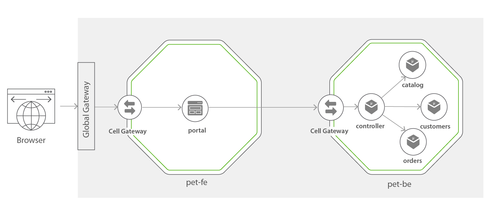
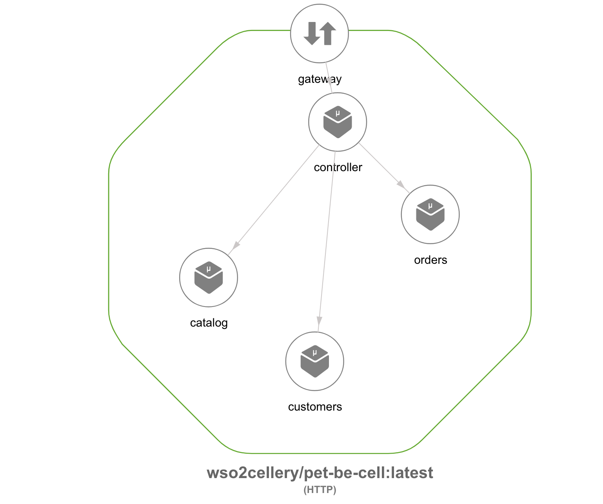
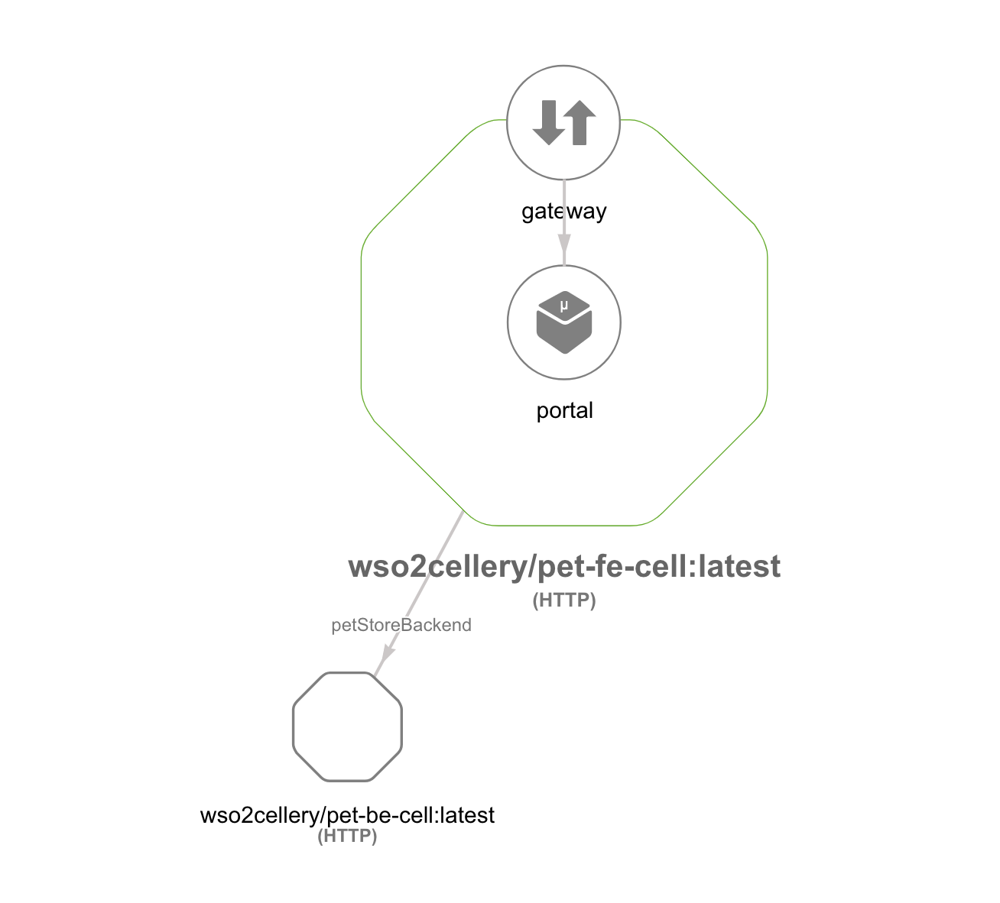
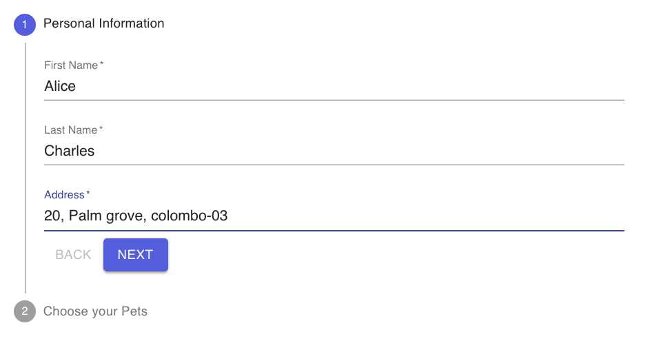
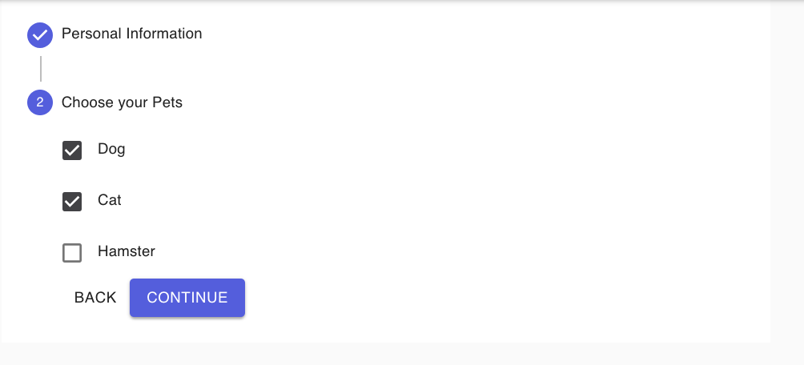
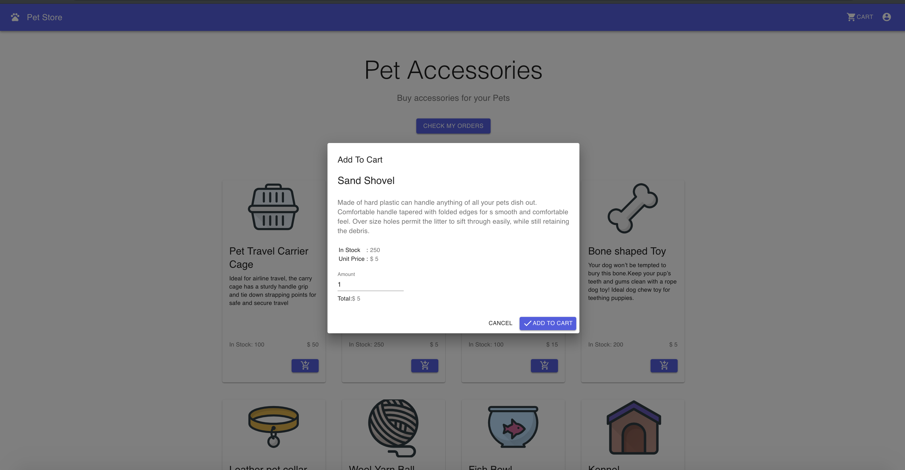
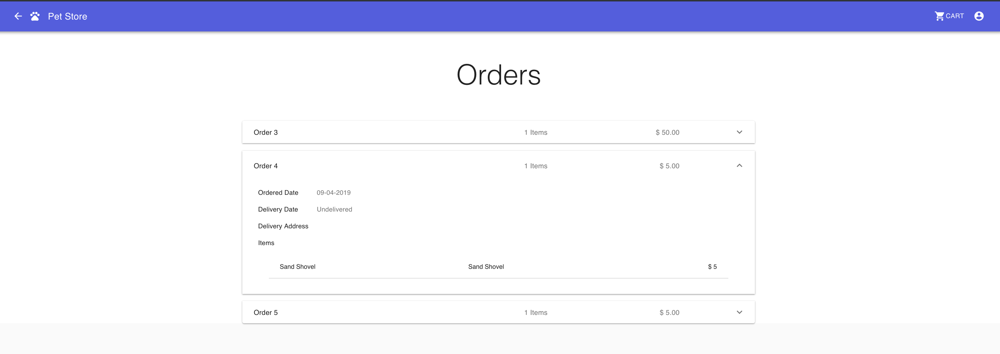
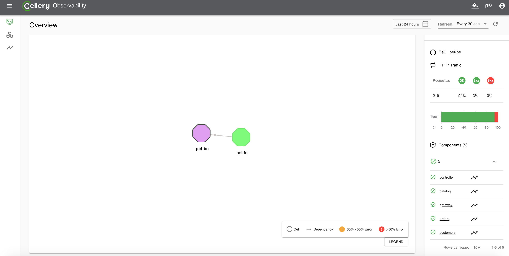
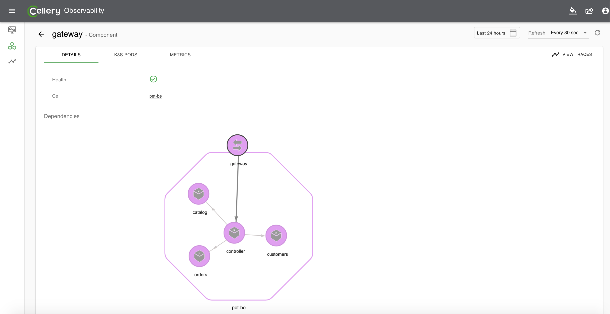
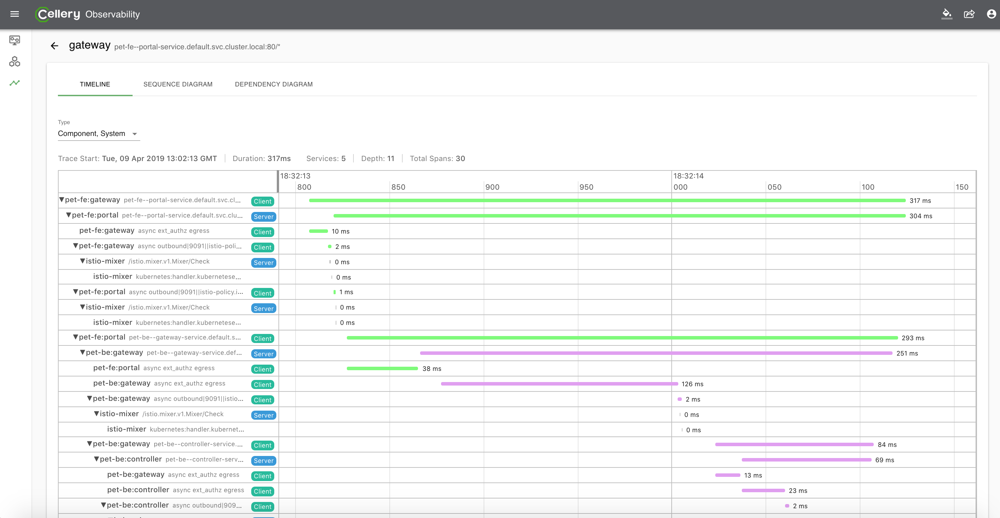

Pet Store
=========

Pet Store is a web portal which can be used by the customers for ordering accessories for their Pets.

This sample is a simple Web App which consists of 5 Docker images (4 microservices and a container to serve the web portal). 

* Catalog (Catalog of the accessories available in the pet store)
* Customers (Existing customers of the Pet Store)
* Orders (Orders placed at the Pet Store by Customers)
* Controller (Controller service which fetches data from the above 3 microservices and processes them to provide useful functionality)
* Portal (A simple Node JS container serving a React App with Server Side Rendering)

All 4 micro services are implemented in [node.js](https://nodejs.org/en/) and portal web application is a [React](https://reactjs.org/) application. 

This sample is structured into two Cells.

* [pet-be Cell](#[pet-be-cell](pet-be-cell-description.md))
* [pet-fe Cell](#[pet-fe-cell](pet-fe-cell-description.md))



## [pet-be cell](pet-be-cell-description.md)
This contains the four components which involves with working with the Pet Store data and business logic. Catalog, customer, and order micro services
are not exposed outside the pet-be cell, and only catalog micro service exposed as cell API which is used by pet-fe cell. 

## [pet-fe cell](pet-fe-cell-description.md)
This contains of a single component which serves the portal. The portal is exposed through a web cell which is able to provide SSO and web content delivery features.

## Try Pet store sample

### 1. Checkout the Sample

1. Clone the [wso2-cellery/samples](https://github.com/wso2-cellery/samples) repository
2. Navigate to the pet-store Sample.
   ```
   cd <SAMPLES_ROOT>/pet-store
   ```

### 2. Build pet-be cell
1.  Build the pet-be cell by executing `cellery build` command as shown below. 
   ```
   $ cd <SAMPLES_ROOT>/pet-store/pet-be
   $ cellery build pet-be.bal wso2cellery/pet-be-cell:0.2.1
   Warning: Value is empty for environment variable "ORDER_HOST"
   Warning: Value is empty for environment variable "CATALOG_HOST"
   Warning: Value is empty for environment variable "CUSTOMER_HOST"
   true
   ✔ Building image wso2cellery/pet-be-cell:0.2.1
   ✔ Removing old Image
   ✔ Saving new Image to the Local Repository
   
   
   ✔ Successfully built cell image: wso2cellery/pet-be-cell:0.2.1
   
   What's next?
   --------------------------------------------------------
   Execute the following command to run the image:
     $ cellery run wso2cellery/pet-be-cell:0.2.1
   --------------------------------------------------------
   ```
2. View the cell information by executing `cellery view` command. This will open up a new tab in the browser and shows 
the component and dependency details of the cell. 
    ```
    $ cellery view wso2cellery/pet-be-cell:0.2.1
    ```
    

3. Execute `cellery list ingress` to see the list ingress suppported by the pet-be cell, and you can see only `controller` component is exposing the API. 
    ```
    $ cellery list ingress wso2cellery/pet-be-cell:0.2.1
      COMPONENT    INGRESS TYPE   INGRESS CONTEXT   INGRESS PORT   GLOBALLY EXPOSED
     ------------ -------------- ----------------- -------------- ------------------
      controller   HTTP           controller        80             False
    ```
    
### 3. Build and run pet-fe cell
1. Build the pet-fe cell by executing the `cellery build` command.
   ```
   $ cd <SAMPLES_ROOT>/pet-store/pet-fe
   $ cellery build pet-fe.bal wso2cellery/pet-fe-cell:0.2.1
   Warning: Value is empty for environment variable "PET_STORE_CELL_URL"
   true
   ✔ Building image wso2cellery/pet-fe-cell:0.2.1
   ✔ Removing old Image
   ✔ Saving new Image to the Local Repository
   
   
   ✔ Successfully built cell image: wso2cellery/pet-fe-cell:0.2.1
   
   What's next?
   --------------------------------------------------------
   Execute the following command to run the image:
     $ cellery run wso2cellery/pet-fe-cell:0.2.1
   --------------------------------------------------------
   ```
2. View the inner components and cell dependency of cell wso2cellery/pet-fe-cell:0.2.1.
    ```
    $ cellery view wso2cellery/pet-fe-cell:0.2.1
    ```
    

3. Run the pet-fe cell with instance name `pet-fe`, and provide the dependent pet-be cell instance as `pet-be`. 
As we haven't started the pet-be cell instance, we'll pass `-d` or `--start-dependencies` flag with run command to 
start dependent cell instance if it is not available in the runtime.
   ```
   $ cellery run wso2cellery/pet-fe-cell:0.2.1 -n pet-fe -l petStoreBackend:pet-be -d
   ✔ Extracting Cell Image wso2cellery/pet-fe-cell:0.2.1
   
   Main Instance: pet-fe
   
   ✔ Reading Cell Image wso2cellery/pet-fe-cell:0.2.1
   ✔ Validating dependency links
   ✔ Generating dependency tree
   ✔ Validating dependency tree
   
   Instances to be Used:
   
     INSTANCE NAME          CELL IMAGE               USED INSTANCE   SHARED
    --------------- ------------------------------- --------------- --------
     pet-be          wso2cellery/pet-be-cell:0.2.1   To be Created    -
     pet-fe          wso2cellery/pet-fe-cell:0.2.1   To be Created    -
   
   Dependency Tree to be Used:
   
    pet-fe
      └── petStoreBackend: pet-be
   
   ? Do you wish to continue with starting above Cell instances (Y/n)?
   
   ✔ Starting instance pet-be
   ✔ Starting dependencies
   ✔ Starting main instance pet-fe
   
   
   ✔ Successfully deployed cell image: wso2cellery/pet-fe-cell:0.2.1
   
   What's next?
   --------------------------------------------------------
   Execute the following command to list running cells:
     $ cellery list instances
   --------------------------------------------------------
   ```
3. Optionally check the status of the running cell pet-fe.
   ```
   $ cellery status pet-fe
           CREATED         STATUS
    --------------------- --------
     5 minutes 3 seconds   Ready
   
   
     -COMPONENTS-
   
      NAME               STATUS
    --------- -----------------------------
     gateway   Up for 4 minutes 52 seconds
     portal    Up for 4 minutes 49 seconds
     sts       Up for 4 minutes 55 seconds
   ```
4. Access the petstore add via accessing [http://pet-store.com/](http://pet-store.com/). You will be landed in the home page of cellery. 
As `/` is configured to be as unsecured context as described [here](pet-fe-cell-description.md), you can see the content of home page without logging in. 

5. Click on `sign in`, and you will be directed to the default IDP installed within cellery runtime. You can sign in as user alice (Username: alice, Password: alice123), 
and fill the customer information form. This operation will invoke the controller and customer micro-services from the pet store portal web application.





6. Once you logged in to the portal application, you can add items to the cart. And then click on the cart to checkout the items. This operation will invoke controller and catalog micro-services.




7. Return to the home page and click on the orders button which will show the orders placed by that user. 



8. You can logout from pet-store as alice user, and you can login as different user admin (Username: admin, Password:admin), and check for orders, which will 
return a empty orders as admin user hasn't placed any order. Therefore, you can realize the pet-store application user specific information.  

Checkout the source of the [pet-fe](pet-fe/components/portal) and [pet-be](pet-be/components), and feel free to play around the source code. 

## Observability 
If you have installed complete setup or basic setup with observability enabled, you can follow below steps to view the cellery observability.

1) Go to [http://cellery-dashboard](http://cellery-dashboard) and you will land in the over view page of the cellery dashboard. 
This will show the overall health of the cells and the system, and the dependencies between the cells.


2) You can click on a cell, and inspect the components of cell. For example, the pet-be cell's components and metrics overview is shown below.



3) Now go you can go into the details of a component `gateway` within the pet-be cell, and it will show the dependency diagram within cell, kubernetes pods, and metrics of the component.




4) You can also trace the each requests that come into the system. 


5) Each trace in the tracing view has timeline view, sequence diagram, and dependency digram view. 




 
## Building the Components from Source

You do not need to build the Components if you just wish to deploy the Cells. This should only be done if you wish to change the Pet Store sample and play around with it.

### Prerequisites

* Docker
* Node & NPM
* GNU Make 4.1+

### Building the Components

If you wish to change the Pet Store Sample and play around with Cellery, you can follow this section to rebuild the Components.

1. Clone the [wso2-cellery/samples](https://github.com/wso2-cellery/samples) repository
2. Set the following environment variables for customizing the build.

   | Environment Variable  |                                                                       |
   |-----------------------|-----------------------------------------------------------------------|
   | DOCKER_REPO           | The name of the repository of the Docker images (Your Docker Hub ID)  |
   | DOCKER_IMAGE_TAG      | The tag of the Docker images                                          |

3. Run the make target for building docker images.
   ```
   make docker
   ```
   This would build the components from source and build the docker images using the environment variables you have provided.
4. Login to Docker Hub
   ```
   docker login
   ```
5. Run the target for pushing the docker images.
   ```
   make docker-push
   ```
6. Update the `<SAMPLES_ROOT>/pet-store/pet-be/pet-be.bal` and `<SAMPLES_ROOT>/pet-store/pet-fe/pet-fe.bal` files and set the newly created image names for the Component source.
7. [Build and run](#2-build-pet-be-cell) the Cells.

## Did you try? 
1. [Hello world](../hello-world)
2. [Hello world Api](../hello-world-api)
