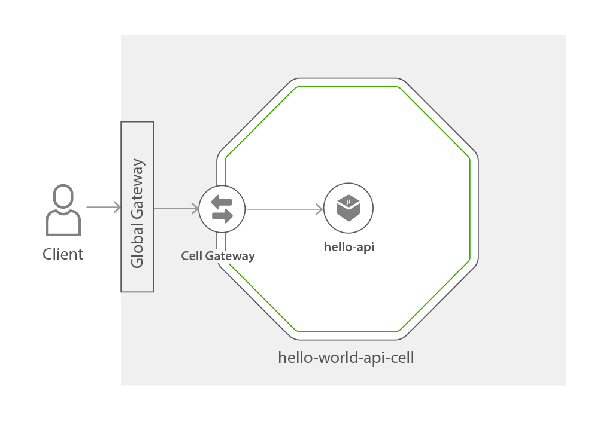

Hello world API cell
===============

Hello World API sample is a simple rest API that returns the text 'Hello World!' as a response to a GET request.



## Building the Components from Source

You do not need to build the components if you just wish to deploy the cells. This should only be done if you wish to change the Hello World API sample and play around with it.

### Prerequisites

* Docker
* GNU Make 4.1+

### Building the Components

If you wish to change the Hello World API Sample and play around with Cellery, you can follow this section to rebuild the Components.

1. Clone the [wso2-cellery/samples](https://github.com/wso2-cellery/samples) repository to your `GO_PATH/src/github.com/wso2cellery` directory. 
2. Set the following environment variables for customizing the build.

   | Environment Variable  |                                                                       |
   |-----------------------|-----------------------------------------------------------------------|
   | DOCKER_REPO           | The name of the repository of the Docker images (Your Docker Hub ID)  |
   | DOCKER_IMAGE_TAG      | The tag of the Docker images                                          |

3. Run the make target for building docker images.
   ```
   make docker
   ```
   This would build the components from source and build the docker images using the environment variables you have provided.
4. Login to Docker Hub
   ```
   docker login
   ```
5. Run the target for pushing the docker images.
   ```
   make docker-push
   ```
6. Update the `<SAMPLES_ROOT>/cells/hello-world-api/hello-world-api/hello-world-api.bal` file and set the newly created image names for the component source.
7. [Build and run](../../cells/hello-world-api#2-build-and-run-hello-world-api-cell) the Cells.

## Did you try? 
1. [Hello world](../hello-world)

## What's Next? 
1. [Try pet store](../pet-store)
